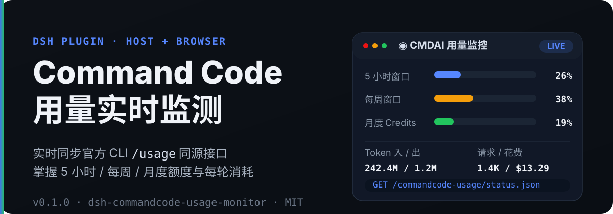
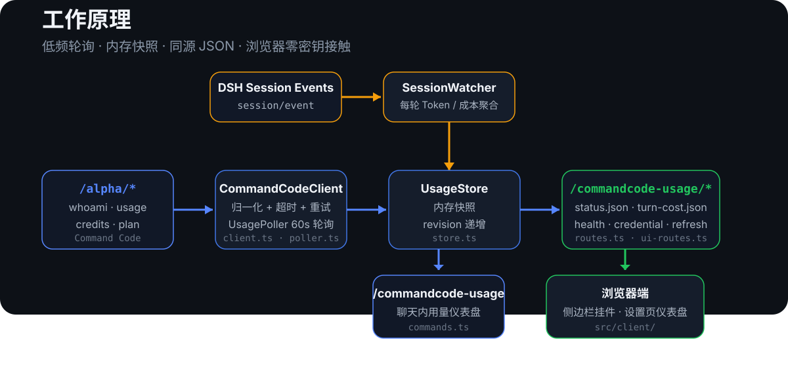

# dsh-commandcode-usage-monitor

<p align="center">
  
</p>

<p align="center"><b>中文</b> | <a href="./README.en.md">English</a></p>

> DSH（DeepSeek Harness）插件：**Command Code 实时用量监测系统**。

本插件运行在 DSH Host 侧，通过调用官方 CLI `/usage` 同源的 Command Code 账号接口（`/alpha/*`），实时抓取：

- 5 小时 / 每周滚动窗口用量与重置时间（个人 Usage 余量）
- 月额度 / 已购 / 赠送 Credits
- 累计请求数、花费、Token
- 套餐信息
- 每轮对话消耗（基于 session 事件中的真实 usage）

并暴露为 DSH Web 同源 HTTP JSON 查询接口，供前端挂件、设置页与聊天节点消费。

---

## 🚀 快速开始

### 方法一：通过 npm 安装（推荐）

插件已发布到 npm，可直接用 DSH 官方插件命令一键安装：

```bash
dsh plugin --profile web add dsh-commandcode-usage-monitor
```

### 方法二：克隆项目本地开发编译

```bash
# 1. 克隆仓库
git clone https://github.com/XingPeng-Pixel/dsh-commandcode-usage.git

# 2. 进入项目目录
cd dsh-commandcode-usage

# 3. 安装依赖并构建（首次需要，生成 lib/）
npm install
npm run build

# 4. 使用 DSH 官方插件命令添加本地源码
#    link:$(pwd) 会自动展开为当前仓库的绝对路径
dsh plugin --profile web add "link:$(pwd)"
```

### 配置 API Key

通过环境变量（默认引用名 `COMMANDCODE_API_KEY`）：

```bash
export COMMANDCODE_API_KEY=user_xxx
```

也可以在 DSH 设置页的 **CMDAI 监控** 页面填写；浏览器侧只调用 Host 凭据路由，不会接触明文 Key。

### 验证接口

```bash
curl http://127.0.0.1:3099/commandcode-usage/status.json
curl http://127.0.0.1:3099/commandcode-usage/turn-cost.json
curl http://127.0.0.1:3099/commandcode-usage/health
```

---

## ✨ 功能特性

### 🔭 Host 数据抓取

- **实时用量快照**：归一化 `/alpha/whoami`、`/alpha/usage/summary`、`/alpha/billing/credits`、`/alpha/billing/subscriptions` 四类数据。
- **滚动窗口余量**：5 小时 / 每周窗口的 `used / cap / exceeded / resetAt`。
- **保守查询策略**：默认 60s 轮询、多账户串行、单请求 15s 超时、网络 / 5xx 最多重试 1 次。
- **错误兜底**：单端点失败独立降级；全失败按 `invalid-key` / `service-unavailable` / `network` 分类。
- **多账户支持**：每个账户独立抓取与失败隔离。
- **多种 API Key 解析**：config 字面量 → `ctx.credentials` → 启动环境变量 → 官方 CLI `auth.json`。

### 🖥️ 浏览器端

- **侧边栏小挂件**：自适应 sidebar footer 宽度，显示 5 小时 / 每周 / 月度用量条、Token 与请求统计。
- **设置页仪表盘**：圆环用量图 + 三档窗口横条 + 累计统计卡片；颜色随使用率从蓝 → 橙 → 红平滑过渡。
- **零密钥接触**：浏览器只消费同源 Host 路由，不接触明文 API Key。
- **中文 / English 语言包**：`src/client/locales.ts` 提供完整双语键集。

### 🔌 查询与消费

- **同源 HTTP JSON 接口**：`status.json`、`turn-cost.json`、`health`、`credential.json`、`refresh.json` 等。
- **聊天斜杠命令**：`/commandcode-usage` 直接展示当前快照用量仪表盘。
- **每轮消耗推送**：监听 `session/event` 的 `assistant/message` usage，`turn/end` 结算，并通过递增 `seq` 通知前端。
- **官方套餐额度表**：`src/plan.ts` 内置套餐月度 / 每周 / 5 小时额度，可计算“本月已用”。

---

## 🧭 工作原理

<p align="center">
  
</p>

1. `UsagePoller` 按配置间隔调用 `CommandCodeClient` 抓取 `/alpha/*`。
2. 抓取结果归一化后写入 `UsageStore`。
3. `routes.ts` 将 `UsageStore` 暴露为同源 JSON 路由。
4. 浏览器端 `src/client/` 通过 JSON 路由读取数据并渲染挂件 / 设置页。
5. `SessionWatcher` 监听 `session/event`，聚合每轮消耗并发布到 `turn-cost.json`。

**关键边界**：所有解析、抓取、错误分类都在 Host 侧完成；浏览器端只拿聚合后的 JSON，API Key 永远不会离开 Host。

---

## 🔌 API 接口

所有路由均为同源 JSON，`Cache-Control: no-store`，并带 `Access-Control-Allow-Origin: *`。

| 路由 | 方法 | 说明 |
| --- | --- | --- |
| `/commandcode-usage/health` | GET | 健康检查 |
| `/commandcode-usage/status.json` | GET | 完整用量快照 + `revision` + `lastError` |
| `/commandcode-usage/turn-cost.json` | GET | 最近一轮消耗 + `seq`（前端轮询判断新轮） |
| `/commandcode-usage/credential.json` | GET / POST / DELETE | 查询 / 写入 / 清除 Host 侧凭据状态 |
| `/commandcode-usage/credential-test.json` | POST | 测试当前解析到的 API Key 是否可用 |
| `/commandcode-usage/refresh.json` | POST | 立即触发一轮 Host 抓取并等待完成 |

`status.json` 中的核心字段：

| 字段 | 说明 |
| --- | --- |
| `updatedAt` | 最近一次成功抓取时间（ms） |
| `stale` | 最近一次抓取是否有失败；`true` 表示数据可能不是最新 |
| `accounts[].configured` | 该账户是否解析到 API Key |
| `accounts[].mark` | `ok` / `rate-limit` / `invalid-credential` / `unknown` |
| `accounts[].report.failures` | 各端点失败信息 |
| `accounts[].report.blocked` | 全失败原因：`invalid-key` / `service-unavailable` / `network` |
| `credits.fiveHour/weekly` | 个人 Usage 余量核心：`used`、`cap`、`exceeded`、`resetAt` |

完整示例与字段说明见 [API 文档](docs/api.md)。

---

## ⚙️ 配置

插件配置由 Schemastery schema 定义在 `src/config.ts`。

| 配置项 | 类型 | 默认值 | 说明 |
| --- | --- | --- | --- |
| `apiKeyEnv` | string | `COMMANDCODE_API_KEY` | 凭据引用名（环境变量 / credentials ref） |
| `apiKey` | string | 空 | 组合配置字面量 API Key（优先） |
| `apiBase` | string | `https://api.commandcode.ai` | Command Code API 地址 |
| `pollIntervalMs` | number | `60000` | 轮询间隔（ms） |
| `errorBackoffMs` | number | `15000` | 失败后退避间隔（ms） |
| `requestTimeoutMs` | number | `15000` | 单请求超时（ms） |
| `accountConcurrency` | number | `1` | 每轮多账户并发抓取数（保守默认 1） |
| `accounts` | array | `[]` | 额外账户列表 |
| `activeAccount` | string | 空 | 固定活动账户 slot id（预留，尚未参与运行时选择） |
| `enableSessionCost` | boolean | `true` | 是否启用每轮消耗聚合 |
| `enableRoutes` | boolean | `true` | 是否注册 webServer JSON 路由 |
| `storagePath` | string | 空 | 可选状态持久化路径（尚未实现，预留） |

### 多账户示例

```yaml
config:
  accounts:
    - label: Account A
      apiKeyEnv: COMMANDCODE_API_KEY
    - label: Account B
      apiKeyEnv: COMMANDCODE_API_KEY_2
```

### API Key 解析顺序

1. `config.apiKey`（组合配置字面量）
2. `ctx.credentials` 服务（若 profile 提供）
3. 启动环境变量（`apiKeyEnv` 指定的名字）
4. 官方 CLI 登录文件 `~/.commandcode/auth.json`

实现见 `src/credentials.ts`。完整配置说明见 [配置文档](docs/configuration.md)。

---

## 🔒 安全

- 浏览器端永远不会接触明文 Command Code API Key。
- 凭据写入通过 DSH credentials 服务完成；未挂载 credentials 服务时 UI 为只读。
- Host 侧解析顺序为：`config.apiKey` → `ctx.credentials` → 启动环境变量 → 官方 CLI `auth.json`。
- 仓库中不提交真实 Key、Token 或个人账户数据；示例数据均为占位符。

更多细节见 [安全文档](docs/security.md)。

### 当前限制

- `turn-cost.json` 的 `amount` 目前为 `null`（尚未内置价格表）；`tokens` 为真实 token 数。后续可通过 `SessionWatcher` 注入 `costFor` 价格换算。
- `storagePath` 与 `activeAccount` 为预留配置，尚未参与运行时行为。
- `/alpha/*` 接口与官方 CLI `/usage` 同源，不属于公开 Provider API 合同；上游接口变化时插件可能需要同步更新。

---

## 🛠 开发

- 环境要求：Node.js `>=22`

```bash
npm install
npm run typecheck
npm test
npm run build
```

- `typecheck`：TypeScript 类型检查
- `test`：Node built-in test + `tsx` 运行单元测试
- `build`：`tsc` 生成类型声明 + `tsdown` 生成 Host / Browser bundle

更多见 [开发文档](docs/development.md)、[测试文档](docs/testing.md) 与 [架构文档](docs/architecture.md)。

---

## 📚 文档

- [安装](docs/installation.md)
- [配置](docs/configuration.md)
- [API 接口](docs/api.md)
- [开发](docs/development.md)
- [测试](docs/testing.md)
- [架构](docs/architecture.md)
- [安全](docs/security.md)

---

## 📄 许可证

[MIT](LICENSE)
