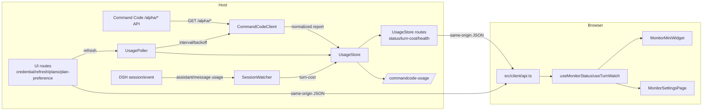

# dsh-commandcode-usage-monitor 项目设施与维护手册

> 本文档按 `codebase-documenter` 思路编写，面向“上游维护 / 快速拾取”场景。
> 它把 README、现有 docs、源码与 DSH 基础编码流程整合成一份可执行的设施手册。

## 1. 项目元信息

| 项 | 值 |
| --- | --- |
| 包名 | `dsh-commandcode-usage-monitor` |
| 版本 | `0.1.0` |
| 类型 | DSH（DeepSeek Harness）组合包 / 插件 |
| 定位 | Host 侧抓取 Command Code `/alpha/*` 用量/额度接口，Browser 侧提供侧边栏挂件与设置页仪表盘 |
| 运行环境 | Node.js `>=22`、ESM、TypeScript |
| 许可证 | MIT |
| 发布入口 | npm：`dsh-commandcode-usage-monitor` |
| 安装命令 | `dsh plugin --profile web add dsh-commandcode-usage-monitor` |

核心亮点：

- Host 侧保守抓取 `/alpha/whoami`、`/alpha/usage/summary`、`/alpha/billing/credits`、`/alpha/billing/subscriptions`。
- Host 内存 `UsageStore` 保存最新快照与每轮消耗，浏览器只读同源 JSON，不接触明文 API Key。
- 浏览器端注册 `sidebar.footer.action` 小挂件与 `settings.section` 设置页，中英双语。

---

## 2. 完整技术栈

### 2.1 Host / 后端侧

| 领域 | 技术 | 说明 |
| --- | --- | --- |
| 运行时 | Node.js `>=22` | ESM，`"type": "module"` |
| 语言 | TypeScript `6.x` | `strict`，`moduleResolution: Bundler`，允许 `.ts` 后缀 import |
| 插件框架 | `@deepseek-ai/cordis` `^4.0.1` | Cordis 插件/Fiber 生命周期、依赖注入、`ctx.effect` 自动清理 |
| 配置 | `@deepseek-ai/schemastery` `^3.18.1` | `Config` interface + 同名 Schema |
| 命令 | `@deepseek-ai/dsh-commands` | `/commandcode-usage` 斜杠命令 |
| 凭据 | `@deepseek-ai/dsh-credentials` | `ctx.credentials` 可选服务；`credentialRef` |
| Web 路由 | `@deepseek-ai/dsh-host-webserver` | `ctx.webServer.register(route)`，`WebRoute` 类型 |
| 启动环境 | `@deepseek-ai/dsh-launch-environment` | `launchEnvironmentOf(ctx).get(envName)` |
| 设置 | `@deepseek-ai/dsh-settings` | `installSettingsSection` / `settingsNamespace` |
| 构建 | `tsc` + `tsdown` | `tsc` 产类型声明到 `lib/types`，`tsdown` 产 Host `/ Browser` bundle |
| 测试 | `node:test` + `tsx` | Node 内置 test runner 直接跑 TS |

### 2.2 Browser / 前端侧

| 领域 | 技术 | 说明 |
| --- | --- | --- |
| UI | React `18` | 函数组件 + hooks |
| 客户端基座 | `@deepseek-ai/dsh-client-store` | DSH `0.1.2-alpha.1` 平台模块表中的 store |
| 客户端类型 | `@deepseek-ai/cordis` | `ClientContext` 即 `Context` 的类型别名 |
| 连接 | `@deepseek-ai/dsh-client-connection` | `ctx.connection` |
| 设置 UI | `@deepseek-ai/dsh-client-ui-settings` | `settings.section` 槽位、`SettingsScope`/`SettingsScopeSpec` |
| 侧边栏 UI | `@deepseek-ai/dsh-client-ui-sidebar` | `sidebar.footer.action` 槽位 |
| 槽位渲染器 | `@deepseek-ai/dsh-client-ui-renderer` | 提供 `ctx.slots` |
| 槽位类型 | `@deepseek-ai/dsh-client-ui-slots` | `PropsLocale`、`PropsRuntime`、`InjectFace` |
| 多语言 | `@deepseek-ai/dsh-client-locale` | `ctx.locale.register` |

> 注：本分支 `0.1.2-comp` 面向 DSH 本地源码 `0.1.2-alpha.1`（`dsh-client-runtime` 已拆为 `dsh-client-store` / `dsh-client-ui-renderer`）。`main` 分支仍面向 npm 发布版 `0.1.1-rc.2`。

| 样式 | CSS Modules + `lightningcss` | 构建期编译 `.module.css`，注入 `<style data-plugin>` |
| 构建产物 | `lib/client.js` | 闭包工厂 `window.__ModuleLoader__.load({ id, factory })` |

### 2.3 外部依赖 / 上游接口

| 外部系统 | 接口 | 说明 |
| --- | --- | --- |
| Command Code API | `/alpha/whoami` | 账户身份；可能带 `org.id`，影响订阅接口的 `orgId` 参数 |
| Command Code API | `/alpha/usage/summary` | 累计请求/花费/Token |
| Command Code API | `/alpha/billing/credits` | 月额度/已购/赠送 + 5 小时/每周窗口 |
| Command Code API | `/alpha/billing/subscriptions` | 套餐信息；`planId` 可能来自 credits 兜底 |
| 官方 CLI 登录态 | `~/.commandcode/auth.json` | 最后一级 API Key 来源 |

> 注意：`/alpha/*` 不是公开 Provider API 合同，上游变化时需同步更新 `src/client.ts` 的解析逻辑与 `src/plan.ts` 套餐表。

---

## 3. 目录结构与入口

```
dsh-commandgo-usage/
├── package.json                 # bundle 声明（dsh.bundle.patch）、exports、peerDependencies
├── cordis.patch.yml             # 插件挂载层：insert 一行 commandcode-usage-monitor
├── tsconfig.json / tsconfig.build.json
├── tsdown.config.ts             # 入口：clientBundle('dsh-commandcode-usage-monitor', ...)
├── build/
│   ├── tsdown.client.ts         # 共享 client bundle 构建预设（来自 DSH monorepo 的单一事实源）
│   └── web-platform.ts          # 浏览器平台模块表（react、cordis、slot 等）
├── assets/readme/               # hero.svg / workflow.svg
├── docs/                        # 项目文档（本手册所在目录）
├── src/
│   ├── index.ts                 # Host 侧 apply 入口：装配 Poller/Routes/Watcher/Command/UI routes/Settings
│   ├── config.ts                # Config/UiConfig/AccountConfig + Schema + 默认值 + resolveConfig
│   ├── credentials.ts           # API Key 解析链 + auth.json 读取
│   ├── client.ts                # CommandCodeClient：/alpha/* 抓取、归一化、失败分类
│   ├── store.ts                 # UsageStore：内存快照、revision、turn cost、事件回调
│   ├── poller.ts                # UsagePoller：定时/退避/并发控制/防重叠
│   ├── routes.ts                # 只读 JSON 路由：status / turn-cost / health
│   ├── ui-routes.ts             # UI 路由：credential / credential-test / refresh / plans / plan-preference
│   ├── session-watcher.ts       # SessionWatcher：session/event 聚合每轮消耗
│   ├── commands.ts              # /commandcode-usage 命令渲染
│   ├── plan.ts                  # 官方套餐表 + 额度计算
│   ├── types.ts                 # 全链路共享数据契约
│   └── client/
│       ├── index.ts             # Browser apply：locale、settings.section、sidebar.footer.action
│       ├── MonitorMiniWidget.tsx
│       ├── MonitorSettingsPage.tsx
│       ├── use-monitor.ts       # 状态轮询 / turn-cost seq 对齐 / 工具函数
│       ├── api.ts               # 同源 fetch 封装
│       ├── locales.ts           # zh/en 字典
│       ├── monitor.module.css   # 自包含颜色变量 + 明/暗主题
│       └── css-modules.d.ts
├── tests/
│   ├── client.test.ts           # CommandCodeClient 解析/降级/分类
│   └── poller.test.ts           # UsagePoller 发布/防重叠
├── lib/                         # 构建产物（lib/index.js、lib/client.js、lib/types/...）
└── README.md / README.en.md / CHANGELOG.md / LICENSE
```

入口点：

- **Host 入口**：`src/index.ts` 的 `apply(ctx, rawConfig)`。
- **Browser 入口**：`src/client/index.ts` 的 `apply(ctx)`。
- **npm 导出**：`.` → `lib/index.js`；`./client` → `lib/client.js`；`./src/*` 供源码引用。

---

## 4. DSH 基础编码流程 / 插件挂载机制

本项目遵循 DSH 插件标准：

1. **插件形态**：导出 `name`、`inject`、`apply(ctx, config?)`；注册全部走 `ctx`，卸载自动清理。
2. **配置**：`src/config.ts` 导出 `interface Config` 与同名 `Config` Schema，默认值写在 Schema / `resolveConfig`；不可硬编码可调参数。
3. **依赖注入**：
   - 必需：`export const inject = ['webServer']`（Host）；浏览器 `inject = ['slots', 'locale', 'connection', 'settingsScope', 'remote']`。
   - 可选：`ctx.get('credentials')` 判空后使用。
4. **副作用生命周期**：`ctx.effect` 内部 `poller.start()`、注册路由/监听/命令；返回统一 disposer 停止清理。
5. **可选服务**：`ctx.inject(['commands'], ...)` 在子 Fiber 中注册命令，卸载自动注销。
6. **设置页**：Host 用 `installSettingsSection(ctx, UI_SETTINGS_NAMESPACE, UiConfig, entry, hooks)` 注册浏览器可改的 UI 偏好。
7. **UI 槽位**：Browser 用 `ctx.slots.inject('settings.section', ...)` 与 `ctx.slots.inject('sidebar.footer.action', ...)` 挂载页面/挂件。
8. **多语言**：`ctx.locale.register(NS, { zh, en })`，`NS = 'commandcode-usage'`。
9. **打包**：`package.json` 的 `dsh.bundle.patch` 指向 `cordis.patch.yml`；安装后 profile 层按行替换。
10. **浏览器隔离**：浏览器只消费同源 Host JSON；任何跨插件 value import 由 `build/tsdown.client.ts` 的 purity gate 在构建期拒绝。

---

## 5. 核心组件与数据流

### 5.1 Host 侧核心类

| 组件 | 文件 | 职责 |
| --- | --- | --- |
| `CommandCodeClient` | `src/client.ts` | 抓取 4 个 `/alpha/*` 端点；独立降级；全失败分类 `invalid-key` / `service-unavailable` / `network`；网络/5xx 重试 1 次；4xx/解析错误不重试 |
| `UsageStore` | `src/store.ts` | 持有最新 snapshot + turnCost + revision；对象替换式更新；可订阅事件 |
| `UsagePoller` | `src/poller.ts` | 按 `pollIntervalMs` 轮询；`errorBackoffMs` 退避；`accountConcurrency` 控制并发；防 in-flight 重叠 |
| `SessionWatcher` | `src/session-watcher.ts` | 监听 `session/event` 的 `assistant/message` usage；`turn/end` 结算；按 `(sessionId, turn)` 聚合；`session/disposed` 清理 |
| `makeUsageRoutes` / `registerUsageRoutes` | `src/routes.ts` | 只读 JSON：`status.json`、`turn-cost.json`、`health` |
| `makeUiRoutes` / `registerUiRoutes` | `src/ui-routes.ts` | UI 管理：credential / test / refresh / plans / plan-preference |
| `commandDefinition` / `applyCommands` | `src/commands.ts` | `/commandcode-usage` 命令文本仪表盘 |
| `resolveApiKey` / `resolveAuthFileApiKey` | `src/credentials.ts` | 按优先级解析 Key |
| `PLAN_*` / `planMonthlyCap` 等 | `src/plan.ts` | 官方套餐额度表与计算 |

### 5.2 Browser 侧核心模块

| 模块 | 文件 | 职责 |
| --- | --- | --- |
| `apply` | `src/client/index.ts` | 注册 locale、设置页、侧边栏挂件 |
| `MonitorMiniWidget` | `src/client/MonitorMiniWidget.tsx` | sidebar footer 紧凑用量条 |
| `MonitorSettingsPage` | `src/client/MonitorSettingsPage.tsx` | 设置页：API Key 配置、Plan 选择、仪表盘 |
| `useMonitorStatus` / `useTurnWatch` | `src/client/use-monitor.ts` | 状态轮询、turn-cost seq 对齐、刷新事件 |
| `api.ts` | `src/client/api.ts` | 同源 fetch 封装 |

### 5.3 主数据流



### 5.4 一次完整抓取流程

1. `UsagePoller.start()` 立即 `runNow()`，之后 `setInterval(runIfDue)`。
2. `CommandCodeClient.fetchAccount(accountId, label)` 先解析 Key：
   - 无 Key → `configured: false`，空报告。
   - 有 Key → `getUsageReport(apiKey)`。
3. `getUsageReport` 依序请求 4 个端点；单端点失败进 `failures`，成功字段仍写入报告。
4. 全部失败时按状态码分类 `blocked`。
5. `UsagePoller.doRun()` 用 worker 池（默认串行）抓取所有账户，组装 `CommandCodeUsageSnapshot` 写入 `UsageStore`。
6. 前端轮询 `/commandcode-usage/status.json` 或 `/commandcode-usage/turn-cost.json` 展示。
7. Browser 点击“测试/保存/刷新”时经 `ui-routes.ts` 触发 Host 动作。

### 5.5 每轮消耗流程

1. `SessionWatcher.start()` 订阅 `session/event`。
2. 遇到 `assistant/message` 且 `data.usage` 存在时，按 `(sessionId, turn)` 聚合 input/cache/output/reasoning tokens。
3. 遇到 `turn/end` 时 `finalize`，把 `TurnCostSnapshot` 写入 `UsageStore`（`seq++`）。
4. 前端 `useTurnWatch` 以 `seq` 判断是否是新的一轮；`amount` 当前始终 `null`（未注入 `costFor` 价格表）。

---

## 6. 对外 API

### 6.1 只读状态路由（`src/routes.ts`）

| 路由 | 方法 | 说明 |
| --- | --- | --- |
| `/commandcode-usage/status.json` | GET | 完整快照 + `revision` + `lastError` |
| `/commandcode-usage/turn-cost.json` | GET | 最近一轮消耗 + `seq` |
| `/commandcode-usage/health` | GET | 健康检查 |

### 6.2 UI 管理路由（`src/ui-routes.ts`）

| 路由 | 方法 | 说明 |
| --- | --- | --- |
| `/commandcode-usage/credential.json` | GET / POST / DELETE | 查询/写入/清除凭据 |
| `/commandcode-usage/credential-test.json` | POST | 测试当前 Key 可用性 |
| `/commandcode-usage/refresh.json` | POST | 强制 Host 立即抓取一轮 |
| `/commandcode-usage/plans.json` | GET | 官方套餐下拉目录 |
| `/commandcode-usage/plan-preference.json` | GET / POST / DELETE | 读取/保存/清除 Plan 偏好 |

所有路由均 `Cache-Control: no-store`，`Access-Control-Allow-Origin: *`。

### 6.3 API Key 解析链（`src/credentials.ts`）

1. 账户级字面量 `accountApiKey`
2. 账户级 env / 顶层 env 名经 `ctx.credentials` 服务
3. DSH 启动环境 `launchEnvironmentOf(ctx).get(envName)`
4. 顶层 `config.apiKey`（仅未指定账户级 env 时）
5. 官方 CLI `~/.commandcode/auth.json`（仅默认账户）

---

## 7. 配置项

Schemastery 定义在 `src/config.ts`，完整表见 `docs/configuration.md`；维护时以 `src/config.ts` 的 `Config` 与 `resolveConfig` 为准。

| 配置 | 默认值 | 说明 |
| --- | --- | --- |
| `apiKeyEnv` | `COMMANDCODE_API_KEY` | 凭据引用名 |
| `apiKey` | `''` | 组合配置字面量 Key |
| `apiBase` | `https://api.commandcode.ai` | Command Code API 地址 |
| `pollIntervalMs` | `60000` | 轮询间隔 |
| `errorBackoffMs` | `15000` | 失败后退避 |
| `requestTimeoutMs` | `15000` | 单请求超时 |
| `accountConcurrency` | `1` | 多账户并发数 |
| `accounts` | `[]` | 额外账户 |
| `activeAccount` | `''` | 预留 |
| `enableSessionCost` | `true` | 是否启用每轮消耗 |
| `enableRoutes` | `true` | 是否注册只读状态路由 |
| `storagePath` | `''` | 预留 |
| `ui.*` | 见 `UiConfig` | 浏览器 UI 偏好 |

---

## 8. 构建 / 测试 / 开发循环

```bash
npm install
npm run typecheck   # tsc --noEmit
npm test            # node --import tsx --test tests/**/*.test.ts
npm run build       # tsc -p tsconfig.build.json && tsdown
```

- `tsconfig.build.json` 只 emit 声明到 `lib/types`。
- `tsdown.config.ts` 通过 `clientBundle` 同时产出：
  - `lib/index.js`（Host / Node）
  - `lib/client.js`（Browser / web dsh.client）
- 浏览器 CSS Modules 由 `build/tsdown.client.ts` 用 `lightningcss` 编译并自动注入 `<style>`。

### 本地安装验证

```bash
dsh plugin --profile web add "link:$(pwd)"
export COMMANDCODE_API_KEY=user_xxx
dsh web --port 3099
curl http://127.0.0.1:3099/commandcode-usage/status.json
curl http://127.0.0.1:3099/commandcode-usage/turn-cost.json
```

> 已知缺口：README / docs 提到的 `scripts/dev-loopback.sh` 在当前仓库中不存在。若需要回环验证脚本，需补齐或从历史版本恢复。

---

## 9. 已知技术债 / 上游维护注意点

- `UsageStore.setError()` 目前无调用方；`status.json` 的 `lastError` 实际几乎总是 `null`。若要让前端看到最近错误，应在 `UsagePoller` 失败分支调用 `store.setError()`。
- `UsageStore.hydrate()` 已实现但未接入；`storagePath` 配置是预留项。
- `activeAccount` 为预留配置，尚未参与运行时选择。
- `SessionWatcher` 的 `costFor` 未注入，`turn-cost.json` 的 `amount` 为 `null`。
- `enableRoutes: false` 只关闭只读状态路由；`ui-routes.ts` 仍会注册。若希望完全关闭 HTTP 面，需要调整 `src/index.ts`。
- `tests/` 只覆盖 `CommandCodeClient` 与 `UsagePoller`；`SessionWatcher`、`routes`、`ui-routes`、`commands`、`store` 尚无单测。
- Command Code `/alpha/*` 非公开合同，字段变化需同步 `src/client.ts` 与 `src/plan.ts`。
- Browser bundle 由 `build/tsdown.client.ts` 驱动；若 DSH 更新平台模块表，需同步 `build/web-platform.ts`。

---

## 10. 快速拾取 / MCP 工作流（推荐）

后续维护时建议优先使用以下本地索引 + 网络检索组合，形成“代码链 → 知识库 → 官方文档”闭环。

### 10.1 codegraph：查询目的组件 / 流程

当前项目索引位于本仓库 `.codegraph/`；DSH 框架源码索引位于：

- 当前项目：`/home/xingpeng/项目/dsh-commandgo-usage`
- DSH 框架源码：`/home/xingpeng/文档/RAG/documents/deepseek-harness`

常用查询示例：

```text
# 当前项目：完整插件装配链
index.ts config.ts credentials.ts poller.ts store.ts routes.ts session-watcher.ts commands.ts plan.ts

# DSH 框架：某个服务接口 / 槽位机制
webServer.register WebRoute
installSettingsSection settingsNamespace
slots.register settings.section sidebar.footer.action
```

### 10.2 txtai：自建知识库索引

- 用 txtai 把本项目 `docs/`、README、CHANGELOG 以及 DSH 官方文档/技能参考资料建成向量索引。
- 拿到相关文档路径后，再用 codegraph 展开对应源码，形成“文档段落 → 文件/符号 → 调用链”的完整链路。
- 适合“上游 `/alpha/*` 变更后，哪些解析代码受影响”这类语义检索。

### 10.3 firecrawl：专业网络搜索 / 抓取

- 当 DSH 上游接口或 Command Code 套餐/接口变化时，用 firecrawl 检索并抓取：
  - DeepSeek Harness 官方文档站
  - commandcode.ai / pricing / docs
  - GitHub issues / PR（`dsh-commandcode-provider`、CLI 相关）
- 抓取结果落地到 `docs/` 或知识库，再对照本地 codegraph 更新代码。

### 10.4 上游维护最小闭环

1. 先看 `CHANGELOG.md` 与 `git log`，了解最近改动。
2. 用 codegraph 对目标组件（如 `CommandCodeClient`、`plan.ts`、`routes.ts`）做 blast radius 查询。
3. 对 `/alpha/*` 返回结构变化，先跑 `tests/client.test.ts`，再更新解析字段。
4. 对 DSH 平台变化（peerDependencies / build 预设），对照 `build/web-platform.ts` 与 DSH 源码索引导航。
5. 改完跑 `npm run typecheck && npm test && npm run build`。
